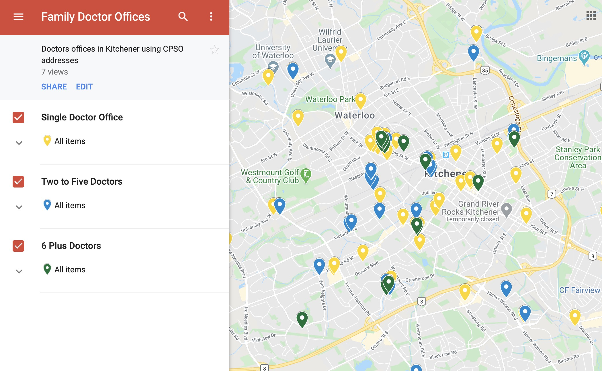

# Doctors in KW

Finding doctors in a specific area is hard even though the data is publicly available as part of their licensing.

This aims to list all doctors in a specific region ranked by the location.

**GOAL:** Rank by distance using location

TODO:
1. Scrape CPSO for doctors in Kitchener, save to file

    Time: 6 hours - incomplete
    I attempted using an existing scraper. It gave me a good head-start but didn't work out of the box. Crawling the site proved to be very difficult.
    I ended up manually downloading the 35 pages.
    Much of the struggle was working with response and beautiful soup for navigating and clicking on boxes. In the future I would use puppeteer for crawling

2. parse files to make tabular data from html listing

    Time: 3 hours - complete repeatable
    This worked quite well in beautiful soup. The data was easy to transform and parse using the tree structure.
    One area that I would want to improve if time permitted would be to put in some kind of validation and monitoring, to confirm my assumptions about the data and flag when the data is incorrect.

3. Rank by distance using location

## Analyze

### 3.1 Plot doctors on a map

Using the address it was possible to plot doctors on a map. This gave a good idea of where the distribution of doctors is. However, it didn't give a strong indication of which offices were the biggest since overlapping points don't show up well in the custom map view.

### 3.2 Getting lat long and aggregating by location

Using Google API I downloaded the location data given an address.

By aggregating the doctor locations to the closes 0.001 lat and long I was able to generate a map that grouped users approximately by clinic.

The results were then uploaded into a Google map and visualized in order for new doctors to find possible opportunities in Kitchener.

